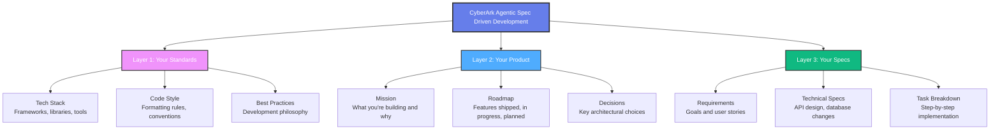

# Welcome to CyberArk Agentic Spec Driven Development

Transform your AI coding agents from confused interns into productive developers with **Spec-Driven Development**.

## What is CyberArk Agentic Spec Driven Development?

CyberArk Agentic Spec Driven Development is a system that makes AI coding agents build **your way, not their way**. It provides structured workflows that capture your standards, your stack, and the unique details of your codebase, giving your agents the specs they need to ship quality code on the first try—not the fifth.

Works seamlessly with both **greenfield** (new) and **brownfield** (existing) projects, integrating into any development workflow without disruption.

### Key Benefits

- 🎯 **Complete Context** - Your standards, product vision, and detailed specs working together
- 🔄 **Structured Development** - Proven workflows that replace random prompting with systematic development
- ⚙️ **Your Standards** - Completely customizable to match how your team operates

## Three Layers of Context

CyberArk Agentic Spec Driven Development works by layering context—just like you'd onboard a human developer:

### 1. Your Standards
- **Tech Stack** — Your frameworks, libraries, and tools
- **Code Style** — Your formatting rules and conventions
- **Best Practices** — Your development philosophy and patterns

### 2. Your Product
- **Mission** — What you're building and why
- **Roadmap** — Features shipped, in progress, and planned
- **Decisions** — Key architectural and technical choices

### 3. Your Specs
- **Requirements** — Goals and user stories for each feature
- **Technical Specs** — API design, database changes, UI requirements
- **Task Breakdown** — Step-by-step implementation plans

## Quick Start

Ready to get started? Choose your path:

### 🚀 Fast Setup (Recommended)
Follow our [Quick Installation Guide](./installation/quick-start) for the fastest way to get up and running.

### ⚙️ Custom Installation
Use our [Manual Installation Guide](./installation/manual) for full control over your setup.

### 👥 Team Setup
Setting up for your team? Check our [Team Installation Guide](./installation/team-setup).

## What You'll Need

Before installing, ensure you have:

- [Node.js](https://nodejs.org/en/download/) version 18.0 or above
- Git installed and configured
- Your preferred AI coding tool (Claude Code / Cursor)
- Terminal access for running installation scripts

## Supported Tools

CyberArk Agentic Spec Driven Development works seamlessly with:

- **Claude Code** - AI coding assistant with specialized agent support
- **Cursor** - AI-powered code editor
- **Any AI coding tool** (In Development) - Flexible integration architecture

## Next Steps

1. **Install** CyberArk Agentic Spec Driven Development using our [installation guide](./installation/overview)
2. **Configure** your standards and preferences
3. **Set up** your first project with spec-driven development
4. **Start building** with AI that understands your way

## Getting Help

- 📚 [Browse our documentation](./installation/overview)
- 💬 [Join community discussions](https://github.com/ChenReuven/cyberark-ai-spec-os/discussions)
- 🐛 [Report issues](https://github.com/ChenReuven/cyberark-ai-spec-os/issues)
- 🌟 [Star us on GitHub](https://github.com/ChenReuven/cyberark-ai-spec-os)
