# Using CyberArk ASDD

With CyberArk ASDD (CyberArk Agentic Spec Driven Development) installed, you're ready to supercharge your AI coding workflow.

At a high level, there are 3 phases that come into play when you're building with CyberArk ASDD:

## 1. Define Your Standards

```mermaid
graph TD
A[🚀 Start] --> B{New or Existing Project?}

B -->|New Project| C[📋 /plan-product]
B -->|Existing Project| D[🔍 /analyze-product]

C --> E[📝 Define Standards
• Tech Stack
• Code Style
• Best Practices]
D --> E

E --> F[📊 Project Setup
• Mission & Vision
• Roadmap
• Architecture]

F --> G[🔄 Feature Development Loop]

G --> H[📋 /create-spec
Create detailed feature spec]
H --> I[✅ Review Spec
Adjust if needed]
I --> J[📝 /create-tasks
Generate task breakdown]
J --> K[✅ Review Tasks
Verify order & completeness]
K --> L[⚡ /execute-tasks
Implement & test]
L --> M[📈 Update Roadmap
Document recap]
M --> N{More Features?}

N -->|Yes| G
N -->|No| O[🎉 Project Complete]

style A fill:#e1f5fe
style O fill:#c8e6c9
style G fill:#fff3e0
style H fill:#f3e5f5
style J fill:#f3e5f5
style L fill:#e8f5e8
```



Using your base installation of CyberArk ASDD, you should customize your coding standards, style, best practices, and common tech stacks used on your projects.

[More on defining standards](#defining-your-standards)

## 2. Initiate a Project

After installing CyberArk ASDD in a project, use `/plan-product` (for a new product) or `/analyze-product` (for an existing codebase) to define the project's mission and roadmap.

[More on planning your product](#starting-a-new-product)

## 3. Plan & Build Features

Feature development with CyberArk ASDD involves a repeating workflow which follows this sequence of commands:

- `/create-spec` - Create the detailed spec for this feature
- `/create-tasks` - Create a tasks list based on the feature spec
- `/execute-tasks` - Proceed with implementation of 1 or several tasks

[More on feature development](#plan--build-a-feature)

## Defining Your Standards

The main benefit of installing the base installation of CyberArk ASDD onto your system is it allows you to define your commonly used coding standards and best practices in one place. Then every time you run your project installer for CyberArk ASDD, it will copy those into your project (where you can customize them further, if you want).

This is how your coding agent follows your best practices and coding style with every single task it executes.

### Edit your tech stack
```bash
~/.cyberark-spec-os/standards/tech-stack.md
```

### Edit your code style
```bash
~/.cyberark-spec-os/standards/code-style.md
```

### Edit your best practices
```bash
~/.cyberark-spec-os/standards/best-practices.md
```

💡 **Pro tip**: Be opinionated! The more specific your standards, the more consistent your agent's output.

## Starting a New Product

First, install CyberArk ASDD into your project by following the [project installation instructions](../installation/overview).

When beginning a new product, you can provide as much or as little detail as you want—though more detail leads to better results by using the `/plan-product` command.

Installing CyberArk ASDD into an existing product that's midway through development? You'll want to use the `/analyze-product` command instead of the `/plan-product` command.

```
/plan-product

I want to build a SaaS tool for tracking customer feedback
Key features: feedback collection, sentiment analysis, reporting dashboard
Target users: Product managers at B2B SaaS companies
Tech stack: Use my defaults
```

**Note**: When starting a new product, feel free to provide as much or as little detail in your initial prompt. You can even invoke the `/plan-product` command with no other details and your agent will then prompt you for the specific details it needs to get started on your product's plan and roadmap.

Once your agent has collected the basic details it needs, it will:

✅ Create `.cyberark-spec-os/product/` structure  
✅ Generate `mission.md` with product vision  
✅ Create a 5-phase roadmap  
✅ Set up your preferred tech stack  

**Important**: Review and edit the generated documentation to ensure it accurately reflects your vision and goals.

## Adding CyberArk ASDD to Existing Products

Have an existing codebase? No problem. Use the `/analyze-product` command (instead of `/plan-product`) to install CyberArk ASDD into your existing codebase.

```
/analyze-product

I want to install CyberArk ASDD in my existing codebase
```

Your agent will:

🔍 Analyze your current code structure  
📊 Detect your tech stack and patterns  
📝 Create documentation reflecting what's already built  
✅ Add completed features to "Phase 0" in the roadmap  

**Important**: Review the generated documentation carefully—your agent's analysis might miss nuances or business context that only you know.

## Plan & Build a Feature

Feature development with CyberArk ASDD involves a sequence of these commands:

- `/create-spec` - Create the detailed spec for this feature
- `/create-tasks` - Create a tasks list based on the feature spec
- `/execute-tasks` - Proceed with implementation of 1 or several tasks

### Feature Development Flow

```mermaid
graph LR
    A[💡 Feature Idea] --> B[📋 Create Spec]
    B --> C[✅ Review Spec]
    C --> D[📝 Create Tasks]
    D --> E[✅ Review Tasks]
    E --> F[⚡ Execute Tasks]
    F --> G[🎉 Feature Complete]
    
    style A fill:#e3f2fd
    style B fill:#f3e5f5
    style D fill:#f3e5f5
    style F fill:#e8f5e8
    style G fill:#c8e6c9
    style C fill:#fff9c4
    style E fill:#fff9c4
```



Let's break down each step:

### Create a Spec

```
/create-spec

Let's add user authentication with email/password and OAuth
```

This will kick off the spec creation process, where your agent will:

📋 Create a Spec Requirements Document (SRD)  
🔧 Write technical specifications  
💾 Design database schemas (if needed)  
🔌 Document API endpoints (if needed)  

**Important**: This is the most critical review point! Carefully examine the SRD, specs, and especially the task breakdown. Adjust anything that doesn't match your expectations before proceeding.

Specs live in: `.cyberark-spec-os/specs/2025-07-16-user-authentication/`

Everything look good? You're ready to proceed to creating the tasks for this spec...

### Create a Tasks List

```
/create-tasks

Please create tasks for this spec
```

Your agent will:

- Create a `tasks.md` file in your spec folder for this feature
- Create a numbered checklist with parent tasks and sub-tasks
- Follow a TDD (test-driven-development) approach when designing the task list and execution order

**Again**: Give this tasks list a close review to ensure all the steps follow your spec, are in a logical order and everything looks as you'd expect.

Ready to go? Proceed with the `/execute-tasks` command and specify which task(s) you want your agent to build.

### Execute Tasks (Start Coding!)

```
/execute-tasks

Please execute all of the tasks for this spec
```

Your agent will proceed with:

- Implement every task, in order
- Delegate to subagents for some steps (if using Claude Code)
- Write and run tests
- Mark tasks as completed
- Update your product's roadmap if milestones have been completed
- Document a recap of what was done and store this in `.cyberark-spec-os/recaps`
- Commit to git

**Note**: Under the hood, the `/execute-tasks` actually runs a series of several sub-processes (which you can inspect in your `/instructions` folder):

- `/execute-tasks` - The main process you called
- `/execute-task` - Runs this on a loop for the implementation of each individual task (and it's sub-tasks)
- `/post-execution-tasks` - Finalizing, commiting to git, updating task list and roadmap, documenting the recap, delivering the final report to you

## Project Structure

After installation, your project will have this structure:

```mermaid
graph TD
    A[📁 .cyberark-spec-os/] --> B[📁 product/]
    A --> C[📁 specs/]
    A --> D[📁 standards/]
    A --> E[📁 recaps/]
    A --> F[⚙️ config.yml]
    
    B --> B1[📄 mission.md]
    B --> B2[📄 roadmap.md]
    B --> B3[📄 decisions.md]
    
    C --> C1[📁 feature-folders/]
    
    D --> D1[📄 tech-stack.md]
    D --> D2[📄 code-style.md]
    D --> D3[📄 best-practices.md]
    
    E --> E1[📄 recap-files/]
    
    style A fill:#e1f5fe
    style B fill:#f3e5f5
    style C fill:#e8f5e8
    style D fill:#fff3e0
    style E fill:#fce4ec
    style F fill:#f1f8e9
```



### File Structure Details

```
.cyberark-spec-os/
├── product/           # Product documentation
│   ├── mission.md     # Product mission and goals
│   ├── roadmap.md     # Feature roadmap
│   └── decisions.md   # Architectural decisions
├── specs/             # Feature specifications
│   └── (created as you work)
├── standards/         # Project-specific standards
│   ├── tech-stack.md  # Technology choices
│   ├── code-style.md  # Coding standards
│   └── best-practices.md
├── recaps/            # Implementation summaries
└── config.yml         # Project configuration
```

## Next Steps

- [Explore best practices](../best-practices/overview)
